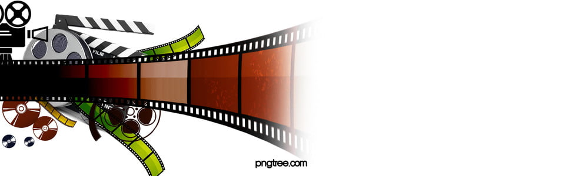

# 🎬 Cards de Filmes de Super-Heróis

  

Este projeto é uma pequena vitrine de cards interativos com informações sobre filmes de super-heróis famosos.

---

## 🔍 Visão Geral

Cada card contém:
- Uma imagem do filme
- Título estilizado
- Sinopse do filme
- Efeitos de hover com destaque visual

O layout é responsivo e elegante, com tema escuro para dar destaque aos filmes.

---

## 🛠️ Tecnologias Utilizadas

- HTML5
- CSS3 (Flexbox e responsividade)
- Tipografia web
- Design moderno com hover e sombras

---
---
